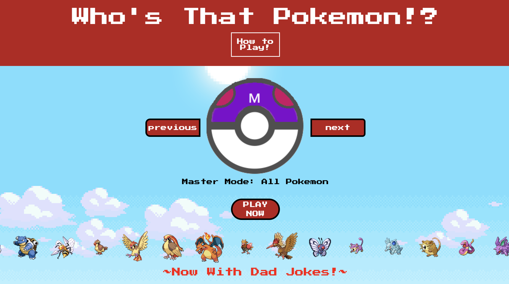
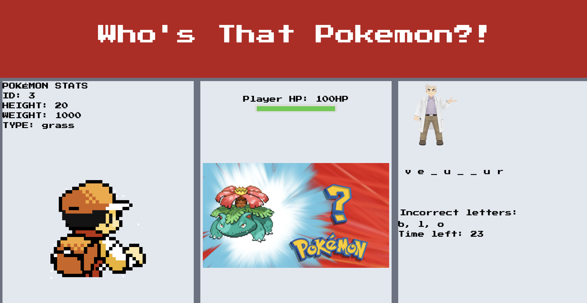
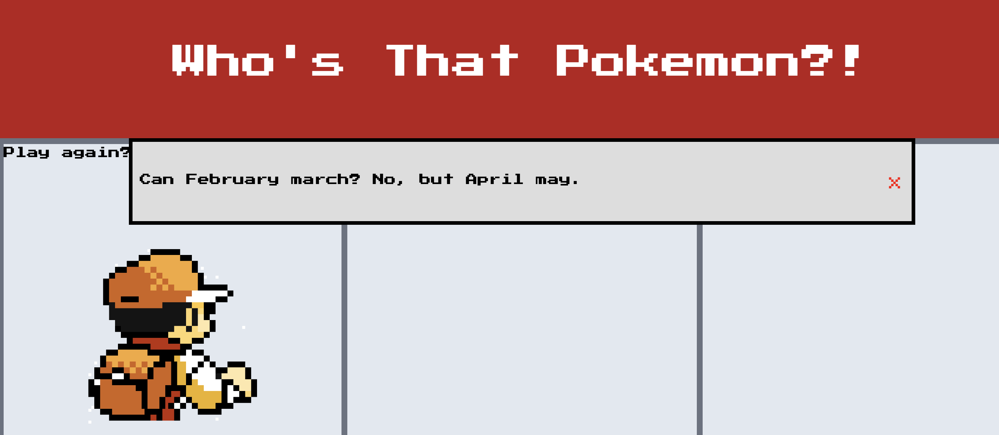

# Who's That Pokémon?!

## Description

- We were motivated to build this pokémon knowledge-building game by our love for the universe of POKÉMON. We wanted to use our skills at combining HTML, CSS, JavaScript, APIs, and third-party frameworks to build an engaging and fun game that helps users learn about the thousands of Pokémon out there. We also wanted to give the game a sense of urgency by punishing losing users with a random dad joke. 

- There are a few reasons why we built this project. First, we wanted to synthesize our knowledge base of JavaScript, CSS, HTML, and third-party frameworks such as Tailwind and JQuery. Second, we wanted to explore the usefulness of APIs in bringing useful content to the user. Third, we want to play the game ourselves.

- This quiz helps to solve the problem of pokémon illiteracy. It also uses third party APIs so that we do not have to locally store the large amount of data that makes up Pokémon lore and stats. 

- Creating this game required us to learn how we could use JavaScript to dynamically alter the page. We needed to identify document elements and create logic to determine how they should behave in a given situation. We learned how to use open-source CSS frameworks to make styling easy. Finally, we learned how to access and manipulate needed information out of the vast amount supplied by our chosen APIs. 

## Table of Contents

- [Usage](#usage)
- [Credits](#credits)
- [License](#license)
- [Features](#features)

## Usage

No installation is necessary; simply visit https://2meng.github.io/Whos-that-pokemon/

PHOTOS:

## Credits/Resources

Poké API:
https://pokeapi.co/

Dad Joke API:
https://icanhazdadjoke.com/api

Tailwind setup:
https://tailwindcss.com/docs/installation

Pokéball photo:
https://www.freepnglogos.com/images/pokeball-16848.html

Marquee:
https://way2tutorial.com/html/html_marquee_image.php

Because Marquee is not even just deprecated, it is no longer supported......
https://stackoverflow.com/questions/337330/javascript-marquee-to-replace-marquee-tags/26372490#26372490

## License

MIT License

Copyright (c) 2023 Adam Robinson, Andrew Nalley, Julissa Ortiz, Toumeng Yang

Permission is hereby granted, free of charge, to any person obtaining a copy
of this software and associated documentation files (the "Software"), to deal
in the Software without restriction, including without limitation the rights
to use, copy, modify, merge, publish, distribute, sublicense, and/or sell
copies of the Software, and to permit persons to whom the Software is
furnished to do so, subject to the following conditions:

The above copyright notice and this permission notice shall be included in all
copies or substantial portions of the Software.

THE SOFTWARE IS PROVIDED "AS IS", WITHOUT WARRANTY OF ANY KIND, EXPRESS OR
IMPLIED, INCLUDING BUT NOT LIMITED TO THE WARRANTIES OF MERCHANTABILITY,
FITNESS FOR A PARTICULAR PURPOSE AND NONINFRINGEMENT. IN NO EVENT SHALL THE
AUTHORS OR COPYRIGHT HOLDERS BE LIABLE FOR ANY CLAIM, DAMAGES OR OTHER
LIABILITY, WHETHER IN AN ACTION OF CONTRACT, TORT OR OTHERWISE, ARISING FROM,
OUT OF OR IN CONNECTION WITH THE SOFTWARE OR THE USE OR OTHER DEALINGS IN THE
SOFTWARE.

## Features

Tailwind CSS
API usage: Poke API and icanhazdadjoke API
Local Storage
